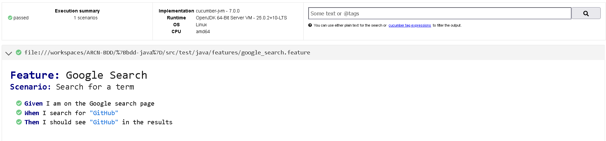

# ARCN-BDD

Mini laboratorio de BDD con Java + Cucumber + Selenium en GitHub Codespaces.

## Que se hizo

- Configuracion de entorno en Codespaces con Java 17, Maven y ChromeDriver.
- Creacion de proyecto Maven `bdd-java`.
- Definicion de escenario BDD en `google_search.feature`.
- Implementacion de steps con Selenium en `SearchSteps.java`.
- Ejecucion de pruebas con `mvn test`.
- Generacion de reporte HTML en `target/HtmlReports/report.html`.

## Resultado

Las pruebas se ejecutan correctamente y el reporte fue generado.

